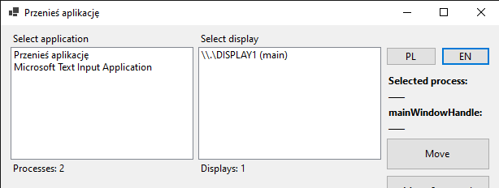
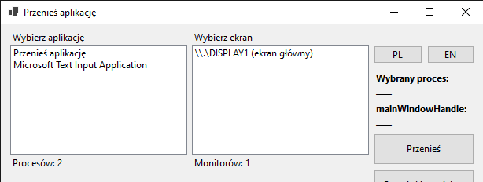

# Przenies aplikacje 🇺🇸

Application to move programs to the second screen.

## Features:

* Can select any visible and running process
* Can select any available display
* Can move any visible and running process to any currently available display
* App has translations for Polish and English

## Tech Info:

* Project created in Visual Studio Community 2022 (x64)
* Release version: 1.0.0

## Compiled program

The compiled program is available in the `bin` folder.

---

# Przenies aplikacje 🇵🇱

Aplikacja do przenoszenia programów na drugi ekran.

## Funkcje:

* Możliwość wyboru dowolnego widocznego i uruchomionego procesu.
* Możliwość wyboru dowolnego dostępnego ekranu.
* Możliwość przeniesienia dowolnego widocznego i uruchomionego procesu na dowolny aktualnie dostępny ekran.
* Aplikacja ma tłumaczenia na języki polski i angielski.

## Informacje techniczne:

* Projekt stworzony w Visual Studio Community 2022 (x64)
* Wersja wydania: 1.0.0

## Skompilowana aplikacja

Skompilowana wersja aplikacji znajduje się w folderze `bin`.

